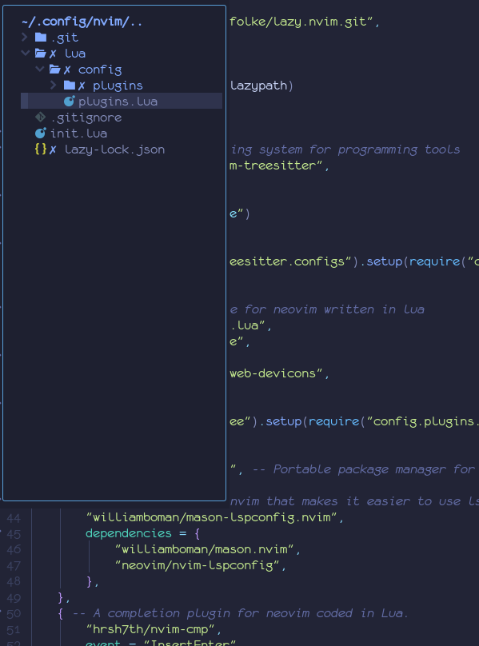

I use a lot of different editors to write code, but my go-to is usually [NeoVim](http://neovim.io/). NeoVim is a fork of Vim, which is itself a clone of Vi. To start this post, I feel like I should explain why I am basically using a text editor from 1976:

The first point is probably the most obvious, but Vim is fast. Vim is designed around doing things with a keyboard, and overall keeping your fingers on the home row, which allows you to type faster. An issue with this is the fact that any code editor that people use has some package/extension that provides these same vim keybinds. So why wouldn't I just use something like VSCode with those?

Well, the real answer to why I use NeoVim is what this post is about: plugins. NeoVim has a large amount of plugins that make using the editor a lot better, and ultimately after all of the customization, it's a great environment. Alright, enough exposition, time for the list:

(Side note: I'm only including the plugins that I think are interesting enough to mention. toggleterm is a great plugin that I use. It's also built in to most editors)

## lazy.nvim
The first thing on the list is a plugin manager, which manages installing and updating all of the plugins that I will talk about in this article. It is pretty easy to use at a basic level. Here is a sample of a configuration:
```lua
require("lazy").setup({
	"jonot-cyber/foo", -- this is the part that comes after the URL for a github repo.
	"whatever/bar", -- Not real packages; no spoilers!
})
```

The real interesting is instead of a string, you can pass a Lua table with additional options, which brings me to the real killer feature of lazy.nvim: *Lazy Loading*

So imagine that you have some cool plugin set up to run when you hit a key. You don't really need to load the plugin until you hit that key, right? What lazy.nvim makes it easy to do is setup functions to load when certain actions happen, like when a file of a certain type is loaded, or when you hit a certain key combination, or when you use one of the functions that it uses. There are a lot more options that I haven't gotten into, but I would say my favorite is "VeryLazy." VeryLazy doesn't wait until a specific event, but wont stop the editor from loading, and will just load it later. This is really useful for more minor UI stuff, or if you just can't figure out when something should load.

By using this, it takes **30 milliseconds** for my editor to load. That's three times as fast as the Vim plugin for VSCode. Keep that time in mind as I go over the rest of the plugins.

[Link](https://github.com/folke/lazy.nvim)

## TreeSitter
My knowledge on how TreeSitter works is pretty limited, but what I understand is that it very roughly parses a source file for syntax highlighting (and some other stuff), and it makes it look a lot better. For example, this comparison that I found on the GitHub readme: 

A full blown IDE can usually get something like the right, but for a text editor running with 20 MB of ram, it looks fantastic. 

It also has support for indents based on the syntax tree, but that is experimental and doesn't work great for a lot of file types.

Ultimately TreeSitter is one of the biggest selling points of NeoVim for me, since no other text editor can do that (other than Emacs) (other than Helix) (I think Atom could?) Whatever, the point is it looks nicer than VSCode IMO.

[Link](https://github.com/nvim-treesitter/nvim-treesitter)

## Nvim-Tree
This has a very similar name, but it's just a file explorer tree. Look at the side of VSCode. See the file tree? It's just that.

I actually have it configured to be floating in the top left, which I think looks really nice: 

[Link](https://github.com/nvim-tree/nvim-tree.lua)

## Mason
You know how in VSCode you can just install an extension for a language to get that nice autocomplete? Well Mason lets you do basically the same thing in NeoVim. Editors like VSCode get completon using LSP, or Language Server Protocol, which allows programs that understand a language to communicate with an editor for completions, diagnostics, etc.

Mason also provides other stuff, like DAP (Depug Adapter Protocol, like the thing I just explained but for debuggers) and formatters.

[Link](https://github.com/williamboman/mason.nvim)

## Which-Key
Which-Key has two useful features. First, if I type part of a keyboard combination, it will show all the choices I can make. If I type "v", for example, it will show that I could then type $ to go to the end of the line, or w to select to the end of a word. Pretty useful since Vim has a lot of shortcuts.

The second useful feature is it makes it pretty easy to add your own key combinations and explain what they do in the same way. This is useful because I consider the default way to add keyboard combinations in NeoVim to be not very fun.

[Link](https://github.com/folke/which-key.nvim) 

## Telescope
Telescope is a pretty big one, and I guess a good comparison would be a Command Pallete, or the Search Everywhere feature in JetBrains IDE's. Pretty useful for running commands, changing themes, changing filetypes, finding functions in files, finding files, finding strings in files, etc.

[Link](https://github.com/nvim-telescope/telescope.nvim)

## Comment.nvim
Comment.nvim gives some useful shortcuts to create comments. Since I am lazy I haven't memorized most of these, but I know that I can use `gcc` to comment out a line, `gco` to add a comment after a line, `gcO` to add a comment above a line, and `gcA` to add a comment at the end of a line.

[Link](https://github.com/numToStr/Comment.nvim)

## nvim-surround
If you take one thing away from this, it should be nvim-surround, because it is the best plugin I have ever used. Essentially, it just makes it very easy to add, change, and remove stuff like parenthesis, brackets, and braces. That might not sound great, but its honestly amazing to use. It's also one of the best thing about NeoVim, because other editors, even with Vim plugins, won't replicate this (well, other than [emacs](https://melpa.org/#/evil-surround))

[Link](https://github.com/kylechui/nvim-surround)

## ChatGPT
This is an interesting one, but I have "\a" set up to open a ChatGPT window, which is pretty cool.

[Link](https://github.com/jackMort/ChatGPT.nvim)

## Hop
Hop is a really nice plugin. When you activate it, you'll see something like this: , if you press any of the letters "l" for example, then all of the letters that weren't l will go back to normal, while all of the "l"s will change to other letters. Eventually, you will narrow it down to a single character, and you will jump there. Again, this is one that is pretty hard to explain, so you should just try it out.

[Link](https://github.com/phaazon/hop.nvim)

## nvim-treesitter-context
Remember treesitter? Well it can do some other nice stuff. And one of those nice things is this. If you are in a very long function, it will keep the top of the function on the top of your screen so you don't have to scroll up to see it.

[Link](https://github.com/nvim-treesitter/nvim-treesitter-context)

## tokyonight
And to finish it off, I will mention the theme that I use. Tokyonight Moon is a really nice theme in my opinion, and as far as I know it doesn't exist for other editors.

[Link](https://github.com/folke/tokyonight.nvim)

# Conclusion
If you already use NeoVim, I hope this inspired you to try out some new plugins that you didn't know about. And if you haven't used NeoVim, maybe you want to try it out. And if configuring software doesn't sound like fun to you for some reason, then you can find plenty of pre-made configurations available on github to download [*cough cough*](https://github.com/jonot-cyber/neovim)

Or maybe it just convinced you to use Emacs. Pretty much every plugin that I have in my whole config has an equivalent in Emacs. And thus, the Editor War rages on...