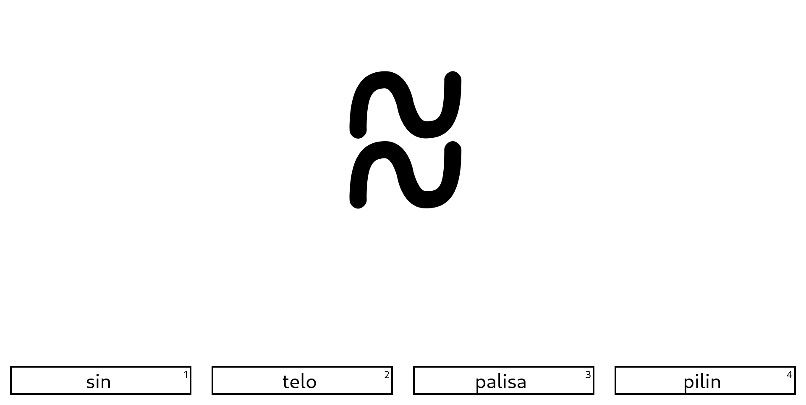
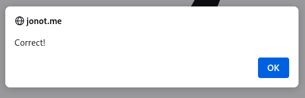

toki! mi pali e lipu sin

Recently I've released my new website that allows you to practice *sitelen pona* symbols, by giving you a symbol and four words, and you have to select the one that matches:

Alright, maybe I should explain somethings

## Toki Pona
Toki Pona is a conlang created by Sonja Lang in 2001. A conlang is a language that was created deliberately, instead of emerging naturally.

One of the main principles of Toki Pona is minimalism. The language has only 137 words (the specific number will vary depending on who you ask) The way a language works with so few words is that each word serves multiple purposes. Take, for example, the word "moku" could mean food, eat, drink, use, or feed depending on context. More complicated ideas can be expressed by combining these words. I could take the word "tomo" which can mean building, and combine it with the word "sona", which can mean knowledge, and make "tomo sona" which means school. It is absolutely one of my favorite languages

## Sitelen Pona
You may have noticed that all of the words up there don't look anything like those squiggles in the website. And that is because Toki Pona doesn't just have one writing system. It is most often written with the latin alphabet, but there are other writing systems (and even a sign language!)

The most popular alternative writing system for Toki Pona is Sitelen Pona. Instead of being an alphabet, where one character represents one sound, Sitelen Pona is a logography, so one character represents a specific word. The most famous example of this are Chinese characters.

## Back to the Website
Now that you have the context needed, I should talk more about the website. So I wanted to learn Toki Pona, and I thought that a website like Quizlet would be a good way to do this. After all, Quizlet is the way that I originally learned Toki Pona's vocabulary, so why not use it again? Well, two reasons:

### I wanted to learn things
By making this website, I was able to get more experience with technologies like react and progressive web apps. The whole point of this was to learn something new, so why would I avoid learning something new by using something that already exists.

### Quizlet isn't good anymore
I think Quizlet did that thing where a tech company realizes that they've never made any profit and then make their own product worse to try to change that. Quizlet used to let you use the learn mode as much as you want. Now that's $8/month. No thanks.

## How it Works
I would say that the most important thing to this website working is the font [sitelen pona pona](https://jackhumbert.github.io/sitelen-pona-pona/). If you've ever used [Fira Code](https://github.com/tonsky/FiraCode), you know that fonts can define special characters to show up when you type characters next to each other. The way that sitelen pona pona uses this is that when you type "soweli" for example, it combines that into the sitelen pona symbol for "soweli", which is this:

This made the app a lot easier because I could just needed to create a list of words. At the top, I show the word in the sitelen pona pona font, and at the bottom I show it in a normal font.

This has the disadvantage that it is trivial to cheat, in multiple ways:
- You can highlight the text with your mouse piece by piece to see how many characters the word has.
- You can just copy paste it somewhere else to see the word.

To remedy this, I set `user-select: none` in the css. It's still pretty easy to cheat by using inspect element, but it doesn't really matter for this app, and also I think it improves the user experience.

## Improvements
There are a few things that I think could be improved with this site.
- There is no dark mode. This is something that I could easily add, so I might change this. **EDIT: As of 2023-01-13, this has been fixed**
- The alerts are annoying. Currently, when you select your answer, it uses the browser `alert()` method to tell you if it was right or wrong.  I am not a fan of this because then you have to hit enter or space to close the alert before moving on. It also just feels sloppy in general.
- Some newer words like "tonsi" and "kijetesantakalu" wouldn't show up in the font, so I had to disable them. I would like them to be there.

Maybe I'll come back and fix these, but knowing myself, I won't make any promises. If you would like to, feel free to contribute on [GitHub](https://github.com/jonot-cyber/sitelen-pona-tester)

## Tips and Tricks
If you just want to try to memorize the symbols, [here's the link](https://jonot.me/sitelen-pona-tester). But after memorizing them all with this site, I have a few tips that might be helpful.

- You should probably learn Toki Pona first. It's a lot easier to associate a symbol to a concept that you understand than to associate a symbol to an arbitrary set of letters. YouTuber jan Misali has a [playlist](https://www.youtube.com/playlist?list=PLuYLhuXt4HrQIv3xnDxZqRaLfmxB2U5rJ) of video lessons you could try.
- Many of the characters graphically represent their meaning. Take the symbol for "tenpo", which means time:  This symbol is visually similar to an analog clock.
- There are patterns between symbols. Symbols for colors all have a triangle. Symbols for pronouns are the same rotated. Many symbols are other symbols combined together. Looking out for patterns between similar words can be helpful to memorizing.
- Simpler words usually have simpler shapes. "li", one of the most common words in Toki Pona, is just two lines.
- Remember when I mentioned the pronouns earlier? Imagine it like a hand pointing. "mi" is pointing towards yourself. "sina" is pointing forwards, towards someone else. "ona" is pointed to the side, like pointing to someone outside the conversation. I definitely didn't just figure that out while writing this.