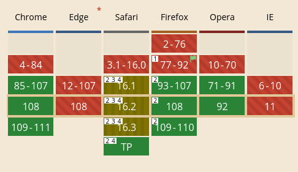

The GIF file format was created in 1987, and it definitely shows. Despite being so widespread on the internet, it has several issues. First of all is color. Most images that you will see on the internet use 24-bit color. Each pixel has a red, green, and blue component, all of which can range from 0-255. This gives you a total of 16,777,216 possible colors. So how many does GIF have? *256*

OK, maybe that is a bit unfair. So GIF files contain a color palette of 256 colors, and each pixel uses one of those colors. And each of those colors can be any of the 16 million mentioned above. But still, it is a major restriction and means that GIFs will often appear as having lower quality. But surely they make up for that with file size, right?

Unfortunately, no. This is surprising to many people, but GIF files are often significantly larger than they would be in other formats.

## So why do people still use it?
Short answer, they don't.

Look at a site like [Giphy](https://giphy.com): The entire purpose of the site is uploading, finding, and sharing gifs. The site is even named after it! Let's try inspect element:

They're actually using a webp! Go try this on other sites. You'll see something similar. The thing is, most online services will convert gifs to other formats.

## But which is best?
And now we get to the point of the article. While the file format itself is outdated, the concept of sending animated images to others certainly isn't. But there are a lot to choose from, so in this article I will compare several different formats to consider.

To do this, I took the video from the Wikipedia article on [Chicken Hypnotism](https://en.wikipedia.org/wiki/Chicken_hypnotism) and converted it to several other formats using ffmpeg. (As part of the CC-BY license, I will now provide a link to the original source by [Rob Simons](https://www.youtube.com/watch?v=6pAZZzw0czM) on YouTube)

I will show the files in order from the longest to the shortest file:

### GIF

File size: **177 MB**

The GIF is the largest of all of the compared file formats, and doesn't look the best.

Additional note: when I tried to upload this, it failed because GitHub has a 100 MB file size limit. So the GIF that you are seeing is only the first half of the video.

### WebP

File size: **47.3 MB**

This video clocks in at a third of the size of the GIF, but comes at a cost, in that the video doesn't look the best. Honestly I think that this has less to do with the file format and more to do with the defaults that ffmpeg provides. Still, it does have several advantages. It works in every major browser and works out of the box in an image

### MP4

<video autoplay muted loop src="video.mp4" width="400px">
</video> 


File size: **9.0 MB**

This is the first file format in this article that is actually designed for video. While being significantly smaller than both of the images shown before, it does have some drawbacks. I mentioned that the webp worked "out of the box" and what I meant by that is that it was treated like an image without doing any tweaking. And mp4 does not. To make this act like a GIF, what I had to do was:
- add the `autoplay` attribute to make the video automatically play. 
- add the `muted` attribute so that the video doesn't make sound.
- add the `loop` attribute so the video repeats after finishing

You may also notice that the video is not the same size as the rest of the images. That is because my Hugo theme doesn't support embedding video, so it doesn't line up.

Still, if you were to make a website, you can get around all of those, making this a pretty good choice. One flaw with it compared to the two formats you'll see below is that the mp4 file format contains patents that could cause issues. Overall, if you don't have to worry about backwards compatability, I would go with the following:

### WebM

<video autoplay muted loop src="video.webm" width="400px">
</video> 


File size: **7.2 MB**

While WebM has many of the same flaws as mp4 in terms of not acting like an image, you do get some major advantages out of it, including it's file size, and the fact that it doesn't rely on any software patents. 

It is also worth noting that this was the original file that all of the others were converted from.

### AVIF

File size: **2.8 MB**

Wow! Only 2.8 megabytes, and you can barely notice a quality difference from the source! A lot of this advantage comes from its use of the AV1 codec, which has the benefits of being patent free and offering better compression than formats like x264. Because of this, sites like YouTube are currently in the process of switching to this format for video delivery. This is clearly the perfect format to use...

...unless you aren't using Chrome.

This is the support of the AVIF image format across all major browsers. At first, it looks great. Chrome, Safari, Firefox, and Opera all support the image format. The major one that's missing is Edge, but that's not a big deal. Except for that *2* in the corner. What that means is that browser doesn't support animated AVIF images. So unless you're using Chrome or Opera, you're out of luck. Overall, it's a great format, but I would wait for other browsers to add support.

## Conclusion
It's important to note that this video was 1080p and lasted 30 seconds, which is longer than most GIFs will be. So you probably don't have to worry that much about the file sizes, but it is still good to keep in mind

Overall, if you are a website designer, I would go with WebM, you get smaller file sizes, and you can deal with all of the issues that being a video might present

If you aren't, I would go with WebP, since it'll just work as an image without you having to do anything.